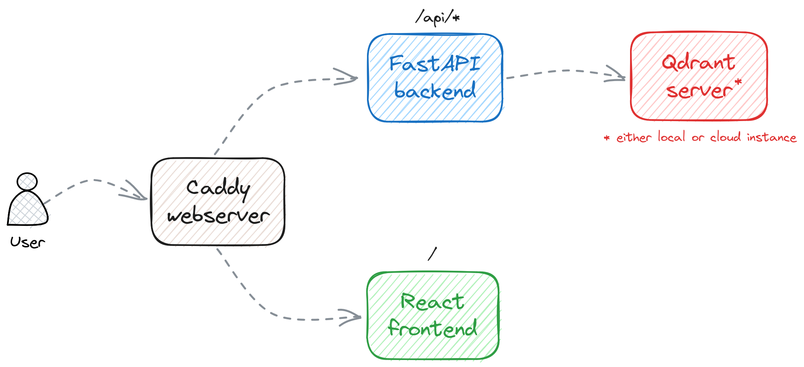
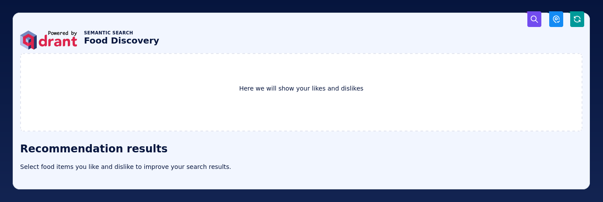
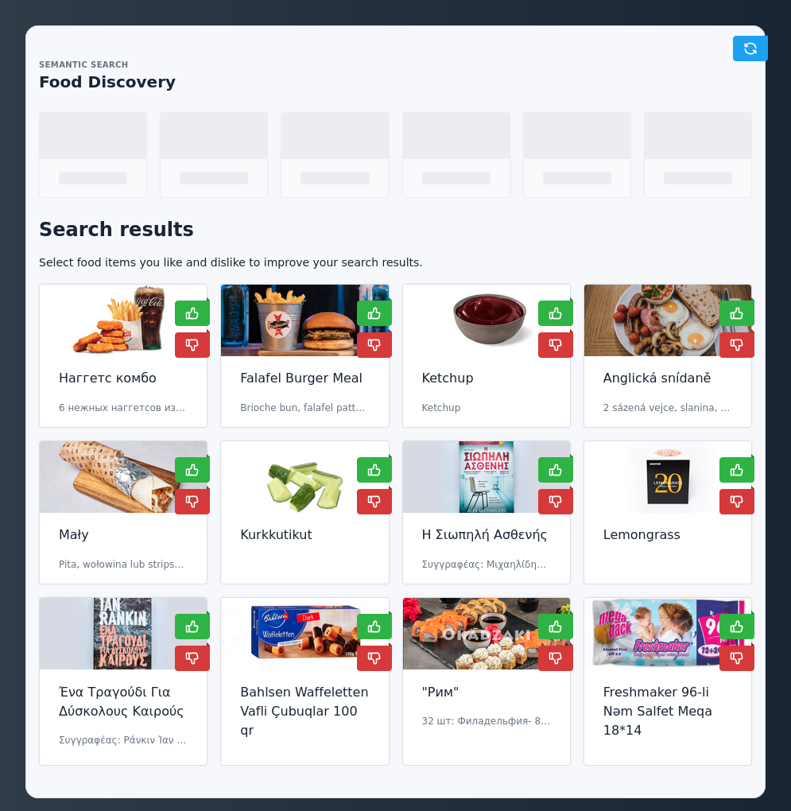

# Food Discovery with Qdrant

## Description

This is a demo project for the [Qdrant](https://qdrant.tech) vector search engine. It 
allows searching for dishes based on their photos. The search is, however, not based on
queries, but on a discovery. The user is presented with a set of images and asked to 
select the ones that they like or not. That's a different paradigm of search, which 
might be more natural for humans in some specific cases, like food. **If you are hungry, 
you might not know precisely what you want, but want to see some options and explore 
them to find something interesting.**

The demo is based on the [Wolt](https://wolt.com/) dataset of dishes. It contains 
over 100k images of dishes from different restaurants. The images are vectorized with
the [CLIP](https://openai.com/blog/clip/) model and indexed in Qdrant. For the 
simplicity, we use the `clip-ViT-B-32` model available in the 
[Sentence-Transformers](https://www.sbert.net/examples/applications/image-search/README.html)
library.

The demo uses the [FastAPI](https://fastapi.tiangolo.com/) framework for the backend and 
[React](https://reactjs.org/) for the frontend, with [Tabler](https://tabler.io/)
web application UI kit. Qdrant [Recommendation API](
https://qdrant.tech/documentation/concepts/search/#recommendation-api) 
is used internally to find some other items that are visually similar to the liked ones 
and dissimilar to the disliked ones. All the components are enclosed in Docker Compose
and can be run with a single command.

Proposed mechanism is embedding-agnostic, so it can be used with any image embeddings.
We do not vectorize queries during the search, but rather use the same embeddings that
were used during the indexing. Thus, there is no vectorization overhead during the 
search, what makes it very fast.

https://github.com/qdrant/demo-food-discovery/assets/2649301/fdee50db-67e4-408c-8252-9f505f45bb12

## Architecture



The demo consists of the following components:
- [React frontend](/frontend) - a web application that allows the user to interact with the demo
- [FastAPI backend](/backend) - a backend that communicates with Qdrant and exposes a REST API
- [Qdrant](https://qdrant.tech/) - a vector search engine that stores the data and performs the search

All the components come pre-configured and can be run with a single command. 

## Usage

If you want to set up the demo locally, you need to have [Docker](https://www.docker.com/)
and [Docker Compose](https://docs.docker.com/compose/) installed. Then, you can follow 
the instructions below.

### Running the demo

In order to set up the demo, you need to have a running Qdrant server. You can either
run it locally or use a [Qdrant Cloud](https://cloud.qdrant.io/) instance. There is a
small difference in how you need to configure the demo in these two cases.

#### Qdrant Cloud instance

If you prefer to use a Qdrant Cloud instance, please create a cluster and API key in
the [Qdrant Cloud Console](https://cloud.qdrant.io). Then, create a `.env` file using
the template provided in the `.env.example` file and set the following variables:

```dotenv
QDRANT_URL=<< QDRANT_URL >>
QDRANT_API_KEY=<< QDRANT_API_KEY >>
QDRANT_COLLECTION=wolt-clip-ViT-B-32
```

`QDRANT_URL` should include the protocol and the port, e.g. 
`https://MY_CLUSTER.eu-central-1-0.aws.cloud.qdrant.io:6333`.

You can adjust the collection name, but make sure that to use the same name for all
the other steps. Once configured, you can launch the project with Docker Compose:

```bash
docker-compose up -d
```

#### Local Qdrant instance

If you decided to run Qdrant locally, you can start with configuring the `.env` file, 
based on the provided `.env.example` template. Here is how it should look like:

```dotenv
QDRANT_URL=http://qdrant:6333
QDRANT_COLLECTION=wolt-clip-ViT-B-32
```

Then, you can launch the project with Docker Compose:

```bash
docker-compose --profile local up -d
```

### Loading the data

At this point, you should have a running demo. However, it does not contain any data,
but the web application is already available at http://localhost:8080. You can open it
in your browser.



Each point in the collection represents a dish with a single image. The image is
represented as a vector of 512 float numbers. There is also a JSON payload attached to
each point, which looks similar to this:

```json
{
    "cafe": {
        "address": "VGX7+6R2 Vecchia Napoli, Valletta",
        "categories": ["italian", "pasta", "pizza", "burgers", "mediterranean"],
        "location": {"lat": 35.8980154, "lon": 14.5145106},
        "menu_id": "610936a4ee8ea7a56f4a372a",
        "name": "Vecchia Napoli Is-Suq Tal-Belt",
        "rating": 9,
        "slug": "vecchia-napoli-skyparks-suq-tal-belt"
    },
    "description": "Tomato sauce, mozzarella fior di latte, crispy guanciale, Pecorino Romano cheese and a hint of chilli",
    "image": "https://wolt-menu-images-cdn.wolt.com/menu-images/610936a4ee8ea7a56f4a372a/005dfeb2-e734-11ec-b667-ced7a78a5abd_l_amatriciana_pizza_joel_gueller1.jpeg",
    "name": "L'Amatriciana"
}
```

We have exported the data from the Wolt dataset and prepared a snapshot that you can
import into your Qdrant instance. 

#### Importing a snapshot

Qdrant documentation describes how to import a snapshot into a Qdrant instance. We are
going to [recover via API](https://qdrant.tech/documentation/concepts/snapshots/#recover-via-api)
directly from the [GCP bucket](https://storage.googleapis.com/common-datasets-snapshots/wolt-clip-ViT-B-32.snapshot). 
You can use the following command to import the snapshot:

##### Local Qdrant instance

If you are using a local Qdrant instance, you can import the snapshot with the following
command. Please adjust the collection name if you want to use a different one.

```bash
curl -X PUT \
    -H "Content-type: application/json" \
    --data '{"location": "https://storage.googleapis.com/common-datasets-snapshots/wolt-clip-ViT-B-32.snapshot"}' \
    http://localhost:6333/collections/wolt-clip-ViT-B-32/snapshots/recover
```

A successful response should look like this:

```json
{
    "result": true,
    "status": "ok",
    "time": 34.737387814
}
```

##### Qdrant Cloud instance

If you decided to use a Qdrant Cloud instance, you need to pass your API key. Other than 
that, the request is the same as for the local Qdrant instance.

```bash
curl -X PUT \
    -H "Content-type: application/json" \
    -H "Api-key: << QDRANT_API_KEY >>" \
    --data '{"location": "https://storage.googleapis.com/common-datasets-snapshots/wolt-clip-ViT-B-32.snapshot"}' \
    << QDRANT_URL >>/collections/wolt-clip-ViT-B-32/snapshots/recover
```

### Using the application

Once your demo is up and running, you can open it in your browser at 
http://localhost:8080 and finally start using it.



By clicking the buttons, you can navigate through the search results and explore your
options by selecting the dishes you like and discarding the ones you don't.

## Links

Some of the links to the resources that were useful during the development:

- https://www.erraticbits.ca/post/2021/fastapi/
- https://tabler.io/docs/getting-started
- https://qdrant.tech/documentation/concepts/snapshots/

## Further steps

If you want to continue working on this demo, here are some ideas for the next steps:

1. Use some additional payload properties and allow filtering by them. It may require
   setting up some [payload indexes](https://qdrant.tech/documentation/concepts/payload/#payload-indexing) 
   and definitely some UI changes.
2. Play with collection configuration to improve the search quality, reduce the latency,
   and/or reduce the memory footprint, as described in the
   [Optimize Qdrant tutorial](https://qdrant.tech/documentation/tutorials/optimize/#optimize-qdrant).
3. Experiment with different models and see how they affect the search results.
4. Consider fine-tuning CLIP model on a food-specific dataset to see how it may improve
   the search quality.
